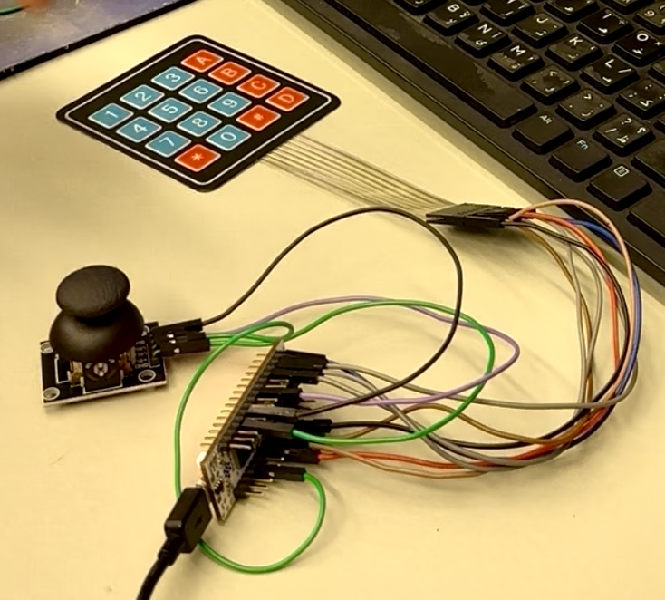
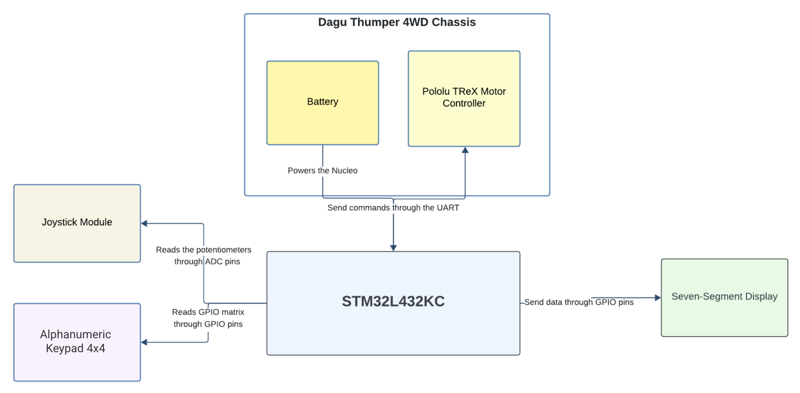
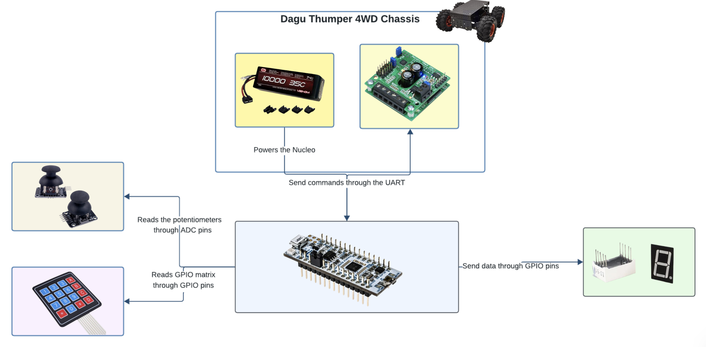

# SmartDrive Assist
Repo: (https://github.com/KirolousFouty/SmartDrive_Assist)

Slides: (https://docs.google.com/presentation/d/1q50BYbvvIYqRlaDNp8o2jzzFzzxluPKRQW1nXwuOVP4/edit?usp=sharing)

## Group Members
- Aly Mahmoud (https://github.com/AlyMohamedd)
- Kirolous Fouty (https://github.com/KirolousFouty)
- Yussuf Abdelrahman (https://github.com/Yussuf12345)

## Abstract
SmartDrive Assist is an embedded motion-control interface for a Dagu Thumper Robot Car powered by an STM32L432KC. It integrates a 4×4 keypad, an analog joystick, and a 1-digit seven-segment display to provide intuitive, precise, and accessible mobility control. The system blends preset speed modes with proportional joystick input and supports safety and precision features, targeting applications like wheelchairs, mobility devices, and assistive robotics.

## Background
- Problem
  - Existing controllers are often expensive, complex, or app-centric, limiting accessibility and ease-of-use.
- Existing Solutions
  - Smartphone-based control apps, high-cost proprietary controllers, and hobby-grade RC solutions lacking safety modes.
- Proposed Solution
  - A low-cost, embedded controller using simple input devices:
    - 4×4 keypad for speed/mode selection
    - Analog joystick for directional control
    - Seven-segment display for feedback
  - Built on STM32L432KC with HAL/CMSIS, PWM motor control, and robust input handling.

## Design
- Hardware
  - STM32L432KC (Nucleo-32 or equivalent)
  - 4×4 keypad (pull-up matrix scanning)
  - Analog joystick (X/Y axes to ADC)
  - Seven-segment display via 74HC595 shift register (SPI or bit-banged)
  - Motor driver (L298N or compatible), dual brushed DC motors (Dagu Thumper)
- Inputs
  - Keypad
    - 0–9: speed levels
    - A: reverse, B: rotate 90° left, C: rotate 90° right, D: stop/reset
    - *: precision-assist mode, #: safety mode toggle
  - Joystick
    - Y-axis: forward/backward
    - X-axis: left/right turning
- Outputs
  - PWM for speed, GPIO for direction
  - SPI/serial for seven-segment updates
- Firmware structure
  - CubeMX-generated project
  - Application entry and peripherals
  - Interrupt handlers
  - HAL UART/RCC APIs

## Implementation Details
- Project configuration
  - Target: STM32L432KCUx
  - Generated HAL setup: SystemClock_Config, GPIO, USART2, ADC1
  - Stack/Heap tuned in IOC (StackSize=0x400, HeapSize=0x200)
- Key modules
  - System clock and RCC setup via HAL RCC macros
  - ADC sampling for joystick axes in ADC1
  - PWM generation for motors using TIM peripherals configured in CubeMX
  - Keypad matrix scanning with GPIO input pull-ups, debouncing in the main loop or timer ISR
  - Seven-segment updates via 74HC595 using SPI or bit-banged GPIO from main
- Interrupts and ISRs
  - NVIC setup and IRQ handlers
  - CMSIS core access utilities available
- Safety and modes
  - Safety mode caps max PWM and rate-limits turns
  - Precision-assist applies low-duty PWM for fine positioning
  - Rotate 90° modes run timed differential motor outputs
  - Stop/reset clears motion, zeros PWM, and resets state

## Final Product (Target)
- Integrated controller running on STM32L432KC
- Real-time motion via joystick with speed/mode selection from keypad
- PWM motor control through Pololu TReX driver
- Non-blocking seven-segment feedback for current speed/mode
- Fully tested on Dagu Thumper with safety and precision modes

## Milestone
- Current wiring image  
  

- Joystick testing video  
  <video controls width="480">
    <source src="joystick.mp4" type="video/mp4">
  </video>

- Keypad testing video  
  <video controls width="480">
    <source src="keypad.mp4" type="video/mp4">
  </video>

- Block diagrams  
    
  

- Achievements
  - Integrated keypad, joystick, and display with STM32 HAL
  - Smooth motion blending of joystick input with preset speeds
  - Robust input handling with debouncing and safety features
  - Successful navigation and mode operations on Dagu Thumper
  - Modular design ready for sensors and closed-loop control

- What’s Left
  - Joystick Value Mapping to Motion Control  
    - Map joystick ADC values to movement commands (forward, reverse, turning).
  - Keypad Integration with Motor Logic  
    - Use keypad inputs to select speed levels, modes, or features.
  - Motor Control Implementation  
    - Generate PWM signals and interface with the Pololu TReX motor driver.
  - Seven-Segment Display Updates  
    - Display current speed/mode in real time without blocking other tasks.
  - System Integration & Testing  
    - Combine keypad + joystick + motor control and test on the Dagu Thumper.

- Feedback
  - Think from a wheelchair user's experience, what do they need?
  - Pre-defined trips with collision avoidance
  - Better display
  - I2C

## References
- STM32L432KC datasheet:
(https://www.st.com/resource/en/datasheet/stm32l432kc.pdf)
- STM32CubeMX
(https://www.st.com/en/development-tools/stm32cubemx.html)